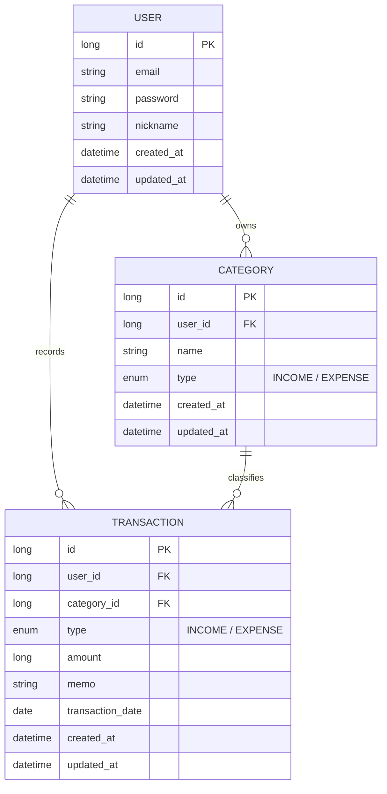

# 💰 머니로그 (MoneyLog)

> 개인이 수입/지출을 기록하고, 카테고리별·월별 통계를 한눈에 보는 RESTful 가계부 API 백엔드 서비스

---

## 🔗 바로가기 (Key Links)

- 🌐 **배포 URL (EC2)**: http://98.94.87.21:8080/
- 📖 **API 문서 (Swagger)**: http://98.94.87.21:8080/swagger-ui/index.html
- 📐 **요구사항 및 설계 문서**: [`docs/Architecture.md`](docs/Architecture.md)

---

## 📌 프로젝트 소개

스마트하고 안정적인 자산 관리를 위해 설계된 **가계부 백엔드 API 서비스**입니다.  
사용자는 회원가입 및 로그인을 통해 본인만의 거래 내역을 기록·관리할 수 있으며, 월별 수입/지출/잔액 통계를 한눈에 조회할 수 있습니다.

* **인증 및 보안:** JWT 기반 Stateless 인증 체계와 BCrypt 비밀번호 암호화 적용
* **데이터 격리:** 인가(Authorization) 처리를 통한 사용자별 개별 데이터 접근 제어
* **응답 규격화:** `{success, code, message, data}` 형태의 공통 응답 봉투(Envelope Pattern) 및 전역 예외 처리 적용
* **자동화된 배포 Pipeline:** GitHub Actions + GHCR + Docker Multi-stage Build를 활용해 AWS EC2 자동 배포 환경 구축

---

## 🛠️ 기술 스택

| 구분 | 기술 스택 |
|------|------|
| **Language & Framework** | Java 17, Spring Boot 3.x, Spring Web, Spring Data JPA |
| **Security** | Spring Security, JWT (jjwt), BCrypt |
| **Database** | H2 Database (In-Memory / File) |
| **API Docs** | springdoc-openapi (Swagger UI) |
| **DevOps & CI/CD** | Docker, GHCR, GitHub Actions, AWS EC2 |
| **Environment** | dotenv-java (`.env` 환경변수 관리) |

---

## 🗄️ ERD (Entity Relationship Diagram)

## 📅 개발 과정 및 회고 (Retrospective)

### 🟢 1일차: 프로젝트 초기 세팅 & 아키텍처 설계
- **아키텍처 및 요구사항 정의:** REST API 명세, ERD 설계 및 문서화 완료 (`docs/architecture.md`)
- **Git 저장소 세팅:** 비밀정보 유출 방지를 위한 `.gitignore` 환경 설정 및 GitHub 원격 저장소 연결

---

### 🟢 2일차: 도메인 계층 구현 및 H2 데이터베이스 연동
- **도메인 & 엔티티 설계:** `User`, `Category`, `Transaction` 엔티티 연관관계 매핑 및 JPA Auditing 적용
- **CRUD 구현:** 카테고리 및 거래 내역 기본 기능 구현
- **H2 데이터베이스 연동:** In-Memory DB 연동 및 초기 시드 데이터 구축
- **🛠️ 트러블슈팅 (Trouble Shooting):**
  - **Spring Security 보안 설정:** 비인증 테스트 환경 확보를 위해 `/api/**`, `/h2-console/**` 허용 정책 세팅
  - **JPA Auditing 제약조건 오류:** `data.sql` 실행 시 `created_at` NOT NULL 제약조건 위반 현상을 `@EnableJpaAuditing`과 `NOW()` 함수 적용으로 해결
  - **Jackson 직렬화 에러:** DTO 객체 응답 시 빈 객체(`{}`)가 반환되는 문제를 DTO 내 `@Getter` 누락 확인 후 수정하여 해결

---

### 🟢 3일차: JWT 인증·인가 및 월별 통계 API 구현
- **Spring Security & JWT 적용:** BCrypt 비밀번호 암호화 및 Access Token 발급/검증 로직 구현
- **데이터 접근 제어:** JWT 토큰 내 `user_id` 기반으로 데이터 조작 및 조회 권한 분리 (본인 데이터만 접근 가능)
- **월별 통계 API:** 특정 연월(YYYY-MM) 기준 총수입, 총지출, 잔액 합계 계산 및 통계 응답 API 구현
- **API 응답 표준화 & 보안 강화:** 
  - 공통 응답 봉투(Envelope) 적용 및 Swagger UI 연동 (Bearer Auth 설정)
  - `dotenv-java` 도입으로 JWT Secret Key 등 중요 민감 정보를 `.env` 파일로 분리하고 `.gitignore`에 등록

---

### 🟢 4일차: CI/CD 파이프라인 구축 및 AWS EC2 자동 배포
- **Docker 컨테이너화:** Multi-stage build 기반 `Dockerfile` 작성 및 GHCR(GitHub Container Registry) 이미지 빌드/푸시 설정
- **GitHub Actions 파이프라인:** Main 브랜치 Push 시 자동 빌드 및 EC2 배포 파이프라인 구축 (`.github/workflows/ci-cd.yml`)
- **🛠️ 트러블슈팅 (Trouble Shooting):**
  - **GitHub Secrets 주입 오류:** Secret Value 내 `KEY=VALUE` 형식이 아닌 Pure Value 매핑 방식으로 변경하여 환경변수 전달 성공
  - **SSH 타임아웃 (`dial tcp: i/o timeout`):** AWS Security Group(보안 그룹) 인바운드 규칙에 SSH(22번 포트) 허용 범위(`0.0.0.0/0`)를 추가하여 CD 배포 성공
  - **보안 조치:** 노출 가능성이 발생한 SSH Private Key를 즉시 재발급하고 Secrets 및 EC2 서버 설정을 전면 교체하여 보안 강화